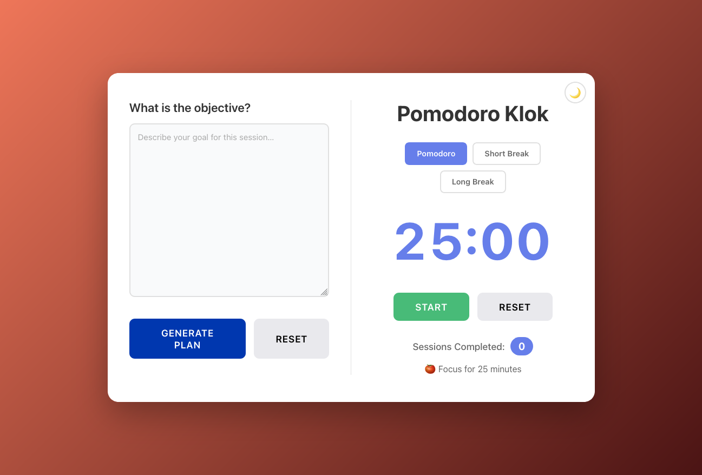

# Pomodoro Klok

A Pomodoro timer web app built with React and an ASP.NET Core backend. Set a session objective and have an AI productivity coach generate a focused plan, past plans are saved locally and can be revisited.



## Features

- Pomodoro, short-break and long-break timers
- Light/dark theme toggle
- Optional AI-generated session plans from a free-form objective
- Plan history persisted in `localStorage` with quick re-selection

## Running Locally

### Prerequisites

- Node.js 18+
- `pnpm`
- .NET 10 SDK (only required for the API / AI features)
- An OpenAI API key (optional)

### Steps

1. **Install dependencies**:
   ```bash
   pnpm install
   ```

2. **Configure the OpenAI API key** (optional):

   Create a `.env` file in the `backend/` directory:
   ```bash
   OPENAI_API_KEY=sk-...
   ```

3. **Start the dev servers** (React + API together):
   ```bash
   pnpm dev:all
   ```

   Or run them separately:
   ```bash
   pnpm dev
   pnpm dev:api
   ```

4. **Open in browser**:
   - Navigate to `http://localhost:3000`

## Running with Docker

```bash
export OPENAI_API_KEY=sk-...
docker compose up
```

Then open `http://localhost:3124`.

## License

MIT
